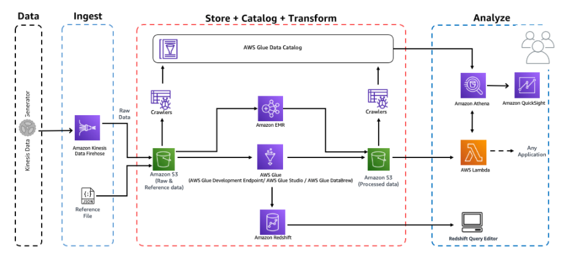

# 서버리스 데이터 분석

AWS에는 서버 운영이나 설치 없이 서버리스로 데이터를 분석할 수 있는 Analytics 서비스들을 제공합니다.&#x20;

AWS Glue는 분석, 기계 학습 및 애플리케이션 개발을 위해 데이터를 쉽게 탐색, 준비, 그리고 조합할 수 있도록 지원하는 서버리스 데이터 통합 서비스입니다. Glue를 사용하면 데이터를 카탈로그로 관리하고 Spark 스타일로 클러스터 운영 없이 ETL을 코드를 실행할 수 있습니다. Glue Databrew와 Glue Studio를 활용하면 코드 없이 데이터를 변환하고 병합하고 저장할 수 있습니다.&#x20;

Athena는 서버리스 SQL 엔진입니다. Athena를 통해 S3의 데이터에 SQL로 분석을 진행할 수 있습니다. CSV, Parquet, ORC 등 다양한 파일 포맷을 지원하고 Glue의 데이터 카탈로그에 있는 데이터를 언제든 분석 가능합니다.&#x20;

Quicksight는 서버리스 BI 대시보드입니다. 서버 설치나 설정없이 바로 브라우저에서 Athena, Redshift, MySQL, PostgreSQL 등을 연결해서 시각화 하실 수 있습니다.&#x20;

아래 영상을 보시고 서버리스 데이터 레이크를 도입해보세요.&#x20;



&#x20;

### 워크샵

서버리스 데이터레이크 분석을 경험하실 수 있는 워크샵입니다.&#x20;

[Analytics on AWS 워크샵 링크 ](https://catalog.us-east-1.prod.workshops.aws/workshops/44c91c21-a6a4-4b56-bd95-56bd443aa449/ko-KR/)

Generator가 만들어내는 데이터를 Firehose로 저장해 Glue Crawler로 데이터 스키마를 파악해 Glue Data Catalog에 저장하고 이를 다양한 분석 서비스들로 분석하는 워크샵입니다.&#x20;

전체 워크샵 모듈은 아래와 같습니다.&#x20;

.png>)

서버리스 데이터 레이크 분석을 경험하시려면 아래 워크샵 중에서 다음 모듈을 진행해보시면 됩니다.&#x20;

* Ingest and Store
* Catalog Data
* Transform Data with AWS Glue
* Transform Data with AWS Glue Studio
* Transform Data with AWS Glue DataBrew
* Analyze with Athena
* Visualize in Quicksight
